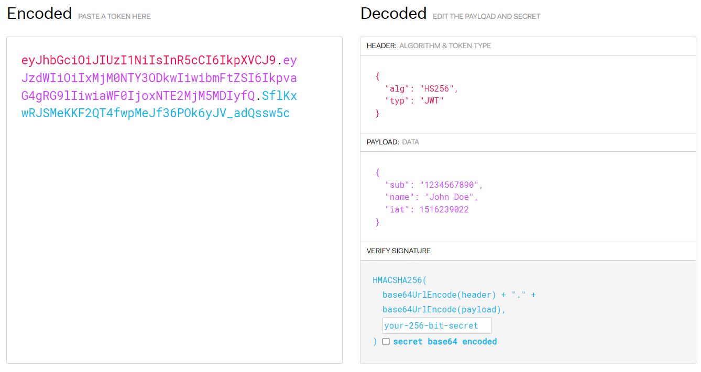

# JWT

## 简介

`JWT（JSON Web Token）` 是一种用于在网络应用之间安全地传输信息的开放标准（RFC 7519）。它通常用于身份验证和授权，其背后的想法为两方通信创建一种标准方式，以确保数据在发送和接收之间的安全性和完整性。`JWT` 是一种紧凑的、自包含的方式来表示信息，这些信息可以被验证和信任，因此在分布式系统和单点登录（SSO）方面广泛应用。

**资料 & 视频：**

* [JWT官网](https://jwt.io/)
* [JWT详解](https://blog.csdn.net/weixin_45070175/article/details/118559272?ops_request_misc=%257B%2522request%255Fid%2522%253A%2522169484436516800197078733%2522%252C%2522scm%2522%253A%252220140713.130102334..%2522%257D&request_id=169484436516800197078733&biz_id=0&utm_medium=distribute.pc_search_result.none-task-blog-2~blog~top_positive~default-1-118559272-null-null.268^v1^control&utm_term=jwt&spm=1018.2226.3001.4450)
* [JWT（简介）](https://blog.csdn.net/qq_65345936/article/details/126919537?ops_request_misc=&request_id=&biz_id=102&utm_term=jwt&utm_medium=distribute.pc_search_result.none-task-blog-2~blog~sobaiduweb~default-0-126919537.142^v94^chatsearchT3_1&spm=1018.2226.3001.4450)

* [什么是JWT授权](https://www.youtube.com/watch?v=soGRyl9ztjI)

* [JWT的结构](https://www.youtube.com/watch?v=_XbXkVdoG_0)

------


## JWT组成

由三部分组成，每部分使用点 `.` 分隔开来：头部(`Header`)、载荷(`Payload`)与签名(`signature`)。

* **头部(`Header`)：**

  `alg` 表示签名所使用的算法，默认为HS256

  `typ` 表示令牌的类型，默认统一为JWT

* **载荷(`Payload`)：**

  包含了要传输的信息，如用户的身份标识、角色或其他声明（`Claims`），Claims分为了注册声明、公有声明、私有声明三种。

  常见的注册声明：

  ```kotlin
  issuer：签发方
  domain：域名
  secret：密钥
  audience：接收方（受众）
  claim：声明（根据需要添加，自定义key和value）
  exp：过期时间
  ```

  需要注意的是JWT的信息默认是不加密的，Payload传递的不要有秘密信息。

* **签名(`signature`)：**

  由前两部分经过 `base64` 编码后，然后根据 `Header` 里面 `Alg` 指定的签名算法生成出来的，签名用于验证令牌的完整性和真实性。



------


## JWT运行机制

这里使用用户登录请求作为场景，介绍 `JWT` 的运行过程。

1. 前端第一次发送登录请求，携带用户信息
2. 后端验证用户信息，如果成功则通过 `JWT` 工具类生成密文字符串，然后以响应头方式返回
3. 前端保存 `JWT Token` 到本地，然后每次请求接口都在请求头中携带它，一般在 `Authorization` 


