## HTTP协议

### 介绍

超文本传输协议（HyperText Transfer Protocol）：一种==无状态==的，以==请求/应答==方式运行的协议，它使用可扩展的语义和自描述消息格式，与基于网络的超文本信息系统（html）灵活的互动。

> 无状态：本次请求响应和下一次请求响应是没有关系的，不会发生数据传递的，这样就是一个无状态。（我们不会存储用户信息）

### HTTP报文格式

**HTTP协议的请求报文和响应报文的结构基本相同，由三大部分组成：**

* 起始行（start line）：描述请求或响应的基本信息

* 头部字段集合（header）：使用 `key-value` 形式更详细地说明报文

* 消息正文（entity）：实际传输的数据，它不一定是纯文本，可以是图片、视频等二进制数据

  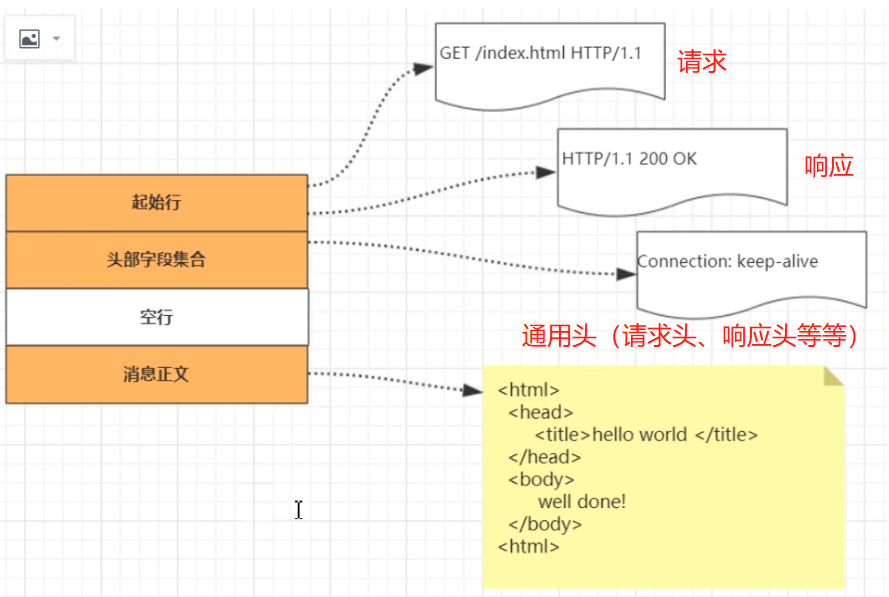

**请求行报文格式：**

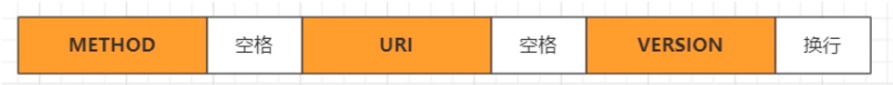

* 请求方法：如 `GET/HEAD/PUT/POST`，表示对资源的操作。
* 请求目标：通常是一个 `URI` ，标记了请求方法要操作的资源。
* 版本号：表示报文使用的 `HTTP` 协议版本。

**响应行报文格式：**

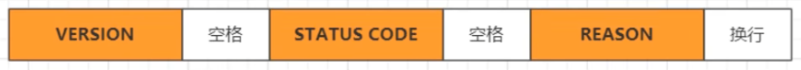

* 版本号：表示报文使用的 `HTTP` 协议版本。

* 状态码：一个三位数组成，用代码形式表示处理的结果，比如200（成功）、500（服务器错误）。

* 原因：作为数字状态码的补充，是更详细的解释文字，帮助人理解原因。

  > 状态码：
  >
  > * 200：ok，正常返回
  > * 302：重定向
  > * 403：访问被禁止
  > * 404：没找到
  > * 400：服务器未能理解请求
  > * 500：请求未完成
  > * 504：网关超时
  > * 505：服务器不支持协议版本

**HTTP 头字段：**

头部字段是 `key-value` 形式，之间用 `:` 分隔开，最后用 `CTRL` 换行表示字段结束。比如前端与后端协商要传输的类型 `Content-Type：application/json` ，这里 `key 就是 Content-Type` ，`value 就是 application/json`。HTTP头部字段非常灵活，不仅使用标准的 `Host、Connection` 已有头，还可以自定义添加头。

* 注意事项：

  * 字段名不区分大小写，不允许出现空格，可以使用 `-`，但不能使用 `_` （有的服务器不会解析），后面必须紧跟 `:` ，不能有空格，在 `:` 后可以有多个空格。

  * 字段的顺序是没有意义的，可以任意排序不影响语义。

  * 字段原则上不能重复，除非字段本身的语义允许，例如 `Set-Cookie` 。

* 常用头字段：（HTTP协议中有非常多头字段，基本分为四大类）

  * 请求字段：请求头中的字段；如 `Host、Referer`。

  * 响应字段：请求头中的字段；如 `Server、Date`。

  * 通用字段：在请求头和响应头里都可以出现；如 `Content-type、Connection`。

### HTTP请求完整流程

1. 浏览器首先根据用户输入的 `URL` 解析出域名

2. 根据域名获取相应的 `ip` ，首先在浏览器缓存中查看，如果没有则从本机的 `hosts` 文件中查看，还没有则从 `LDNS` 、`Rootserver` 域名服务器、国际顶级域名服务商的 `DNS` 层层解析。

3. 拿到 `ip` 地址后，浏览器开始与服务器发起三次握手

4. 握手建立后，开始组装 `http` 请求报文，发送报文

5. 服务器收到请求报文后，开始报文解析、生成响应数据、发送响应数据

6. 浏览器收到数据后，开始渲染页面

   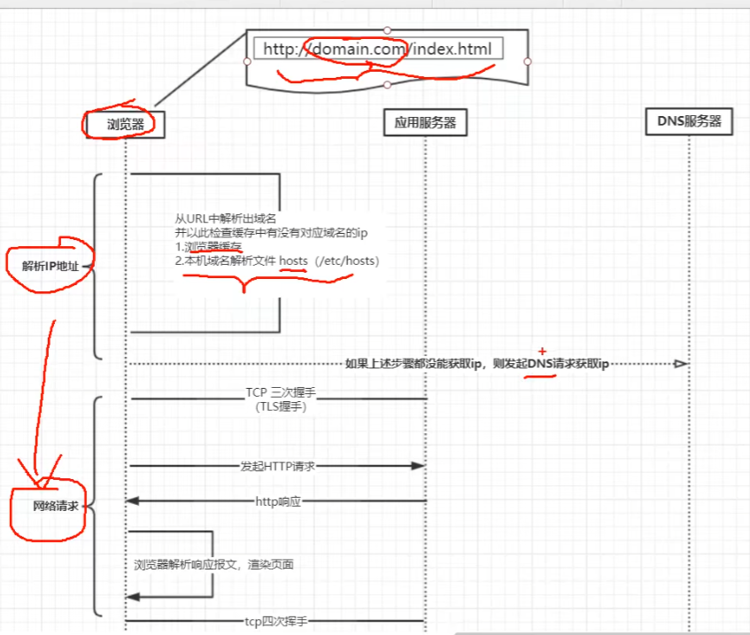

### Cookie和Session

#### Cookie

是一段保存在==客户端==的小文本，能够用来将==用户==活动过程中的==状态信息==保存到客户端，服务器可以获得该信息以便进行处理，跟踪到用户的状态。让程序员在本地存储数据的能力，让数据在客户端这边更持久化。

Cookie 里面存的是==键值对==的格式数据，键值对用“；”分割，键和值之间用“，”分割。

浏览器存的 Cookie 都是从服务器的响应“报头”里面的 set-cookie 字段中来的，每个 set-cookie 字段里面都包含一个 Cookie 这样的键值对，浏览器拿到响应之后就会把 set-cookie 中的内容==保存到本地==，而 set-cookie 就是程序员自己在==服务器中构造==填写的。

**cookie的工作原理：**

1. 浏览器第一次发送请求到服务器端；
2. 服务器端创建 Cookie，该 cookie 中包含用户的信息，然后将该cookie发送到浏览器端。
3. 浏览器端再次访问服务器端时会携带服务器端创建的 Cookie。
4. 服务器端通过 cookie 中携带的数据区分不同的用户。

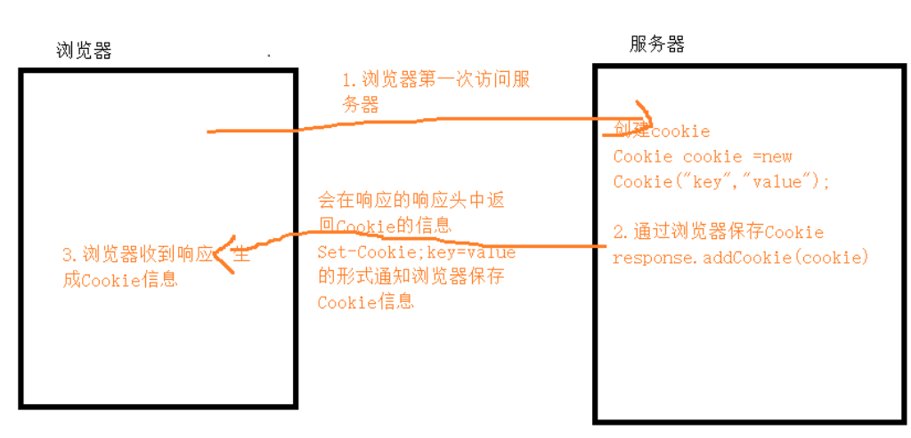

#### Session

session 中文翻译是==会话==，session 是在==服务器==的一种机制，Session 是存储在服务器(应用服务器)上的对象，该对象由服务器创建并维护；服务器为客户端与服务器的每一次会话过程都创建并维护一个Session对象。

**Session的工作原理：**

1. 浏览器端第一次发送请求到服务器端，服务器端创建一个session，同时会创建一个特殊的cookie，然后将cookie发送至浏览器端
2. 浏览器端发送第N（N>1）次请求到服务器端，浏览器端访问服务器端的时候会携带cookie对象
3. 服务器端会根据 cookie 的 value 值去查询Session对象，从而区分不同用户。

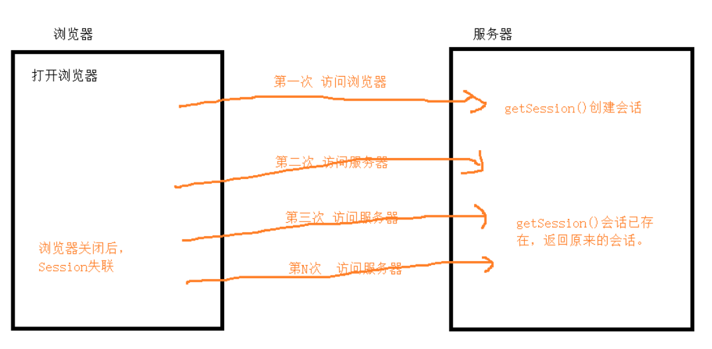

#### 两者区别

* cookie 数据存放在客户的浏览器，session 数据放在服务器
* cookie 不是很安全，别人可以分析存放在本地的cookie并进行cookie欺骗，如果考虑到安全应当使用session
* session 会在一定时间内保存在服务器上。当访问增多，会比较占用你服务器的性能，如果主要考虑到减轻服务器性能方面，应当使用 cookie
* cookie 可以存放身份信息也可以存放关键的信息（程序员自定义）；session 主要用来存储重要身份相关的信息 

## TCP协议

### 介绍

TCP（Transmission Control Protocol）：面向==连接的==，==可靠的==，基于==字节流==的传输层通信协议

**特点：**

* 基于连接的：数据传输之前需要建立连接
* 全双工的：双向传输
* 字节流：不限制数据大小，打包成报文段，保证有序接收，重复报文自动丢弃
* 流量缓冲：解决双方处理能力的不匹配
* 可靠的传输服务：保证可达，丢包时通过重发机制实现可靠性
* 拥塞控制：防止网络出现恶性循环

**TCP连接管理：**

1. TCP 连接：四元组【源地址、源端口、目的地址、目的端口】
2. 确立连接：TCP三次握手
   - 同步通信双方初始序列号（ISN、initial sequence number）
   - 协商TCP通信协议（MSS，窗口信息，指定校验和算法）

**握手流程：**

客户端通过查看服务端返回的报文中 `ack` 的值判断，如果是上一条发送给服务端的报文 `seq的值+1` 的话，说明服务器端已经收到客户端的请求

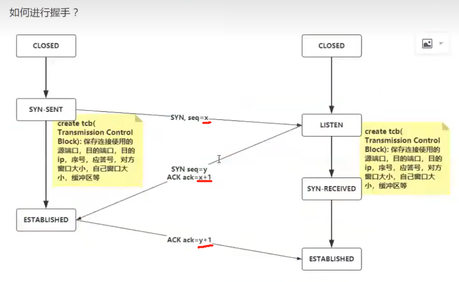

模拟三次握手，抓取3条报文，如下：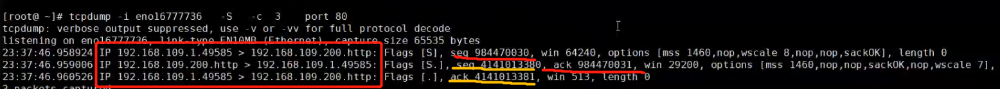

**数据可靠性传输**

停止等待协议：

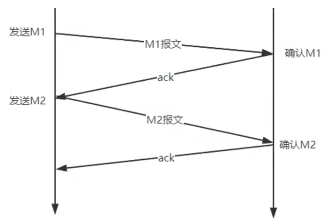

**重传机制**

1. ack报文丢失：在一定时间内，如果没有收到ack报文那么会进行重传

   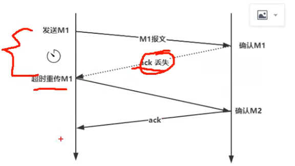

2. 请求报文丢失：在一定时间内（一般为一个报文来回的时间），如果没有收到ack报文那么会进行重传

   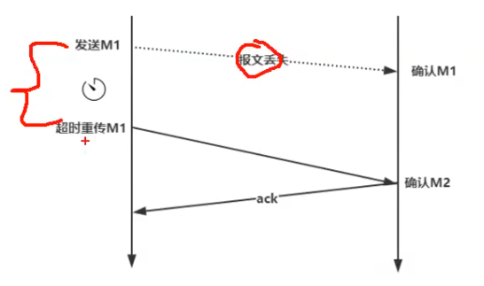

这样2种都会是很==消耗网络资源==的，所以使用 ==滑动窗口协议==和累计确认（延时ack），滑动窗口大小同通过 tcp 三次握手和对端协商，且受网络状况影响。

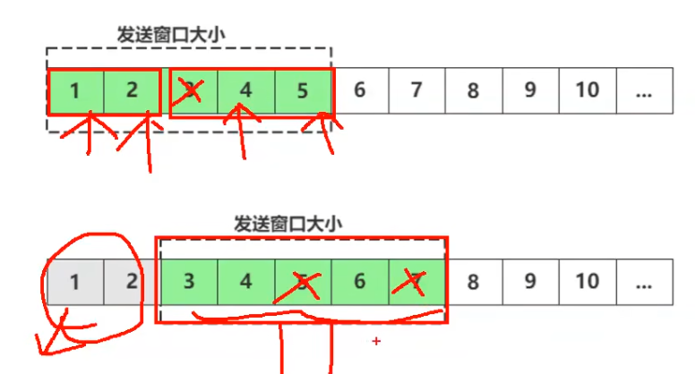

例如：一次发送5个报文，客户端只收到了1、2、4，那么就会滑动窗口从3到7重新发送报文，已确认的报文1、2就会被丢弃掉

经过不断更新，tcp还有一种算法可以选择性的重传报文，例如：窗口从3到7发送报文，5和7丢包了，那么响应ack的时候把对应的5和7的偏移量告诉客户端，发生了丢包

------

## HTTPS协议

### 介绍

由于 `Http` 天生==明文==的特点，整个传输的过程中完全透明，任何人都能在链路进行截取、修改或者伪造请求报文/响应报文，所以数据不具有可信性。因此诞生了 `Https` 协议。

使用 `Https` 时，所有的 `Http` 请求和响应都要在发送到网络前，进行加密。

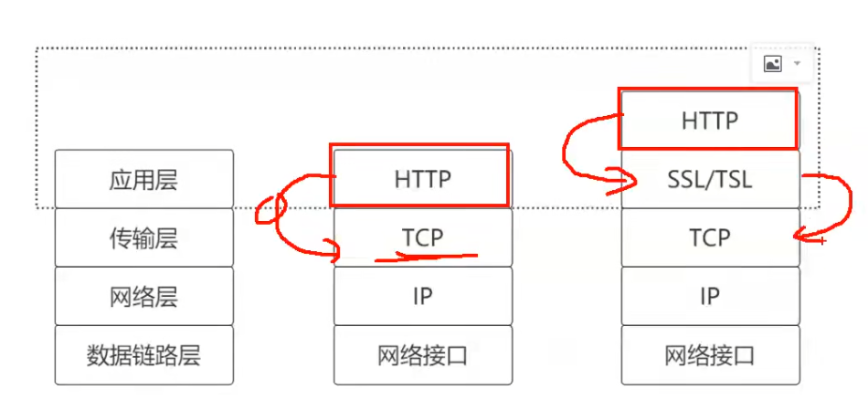

可以看到 `Https` 并没有对 `Http` 进行修改，而是改为把数据先提交到安全层（SSL）加密，然后再到 TCP 层然后一直往下传输，收到回传后再由TCP传到安全层由（TSL） 解密

### SSL/TLS

SSL 即安全套接层，在99年改名为 TLS（传输层安全）

### HTTPS加密通信原理

首先服务器会部署公钥、私钥（私钥不会进行网络操作）

1. 客户端和服务端进行三次握手后客户端拿到了公钥
2. 随后客户端发送加密套件列表给服务端（里面包含客户端支持的加密算法）
3. 服务端收到后会选择两端都支持并且最安全的算法，然后发送公钥数字证书给客户端
4. 客户端验证证书后随机生成一个密钥（用于后续双向通信传输）并使用公钥进行加密发送给服务端
5. 服务端使用私钥解密后拿到客户端的密钥
6. 最后就可以和客户端进行加密的双向传输。

> 加密原理主要采用：对称和非对称加密两种混合算法，先是使用非对称加密算法让服务端获取到通信的密钥，两端都持有密钥后使用对称加密算法进行通信。既能安全地交换密钥，也能高效地加密解密。

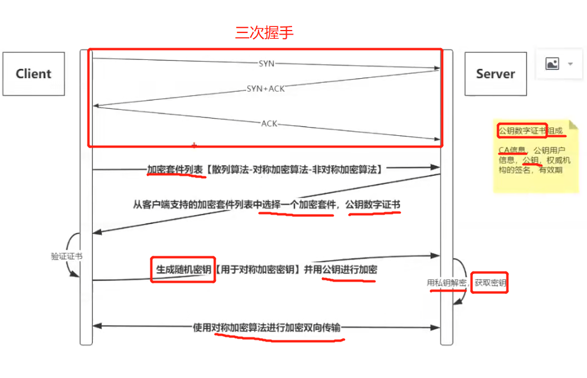

------

## 网络分层

1. 复杂网络的流程图

   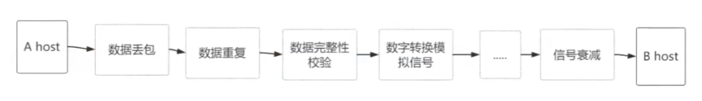

2. 为了简化网络，网络通信会被分解成多层次结构，每一层只需要与上层或下层进行交互，将网络分层，这样就可以修改甚至替换某一层的软件，只需要层与层之间的接口保持不变，就不会影响其他层。

3. 网络分层大概分为2种方法：

   * OSI（Open System Interconnection Reference Model）：开放系统互联网参考模型

   * TCP/IP 协议族

     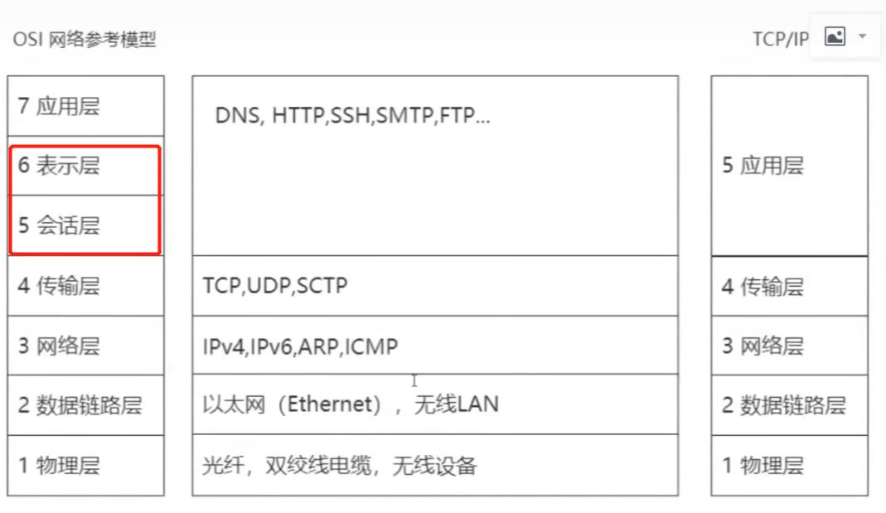

4. HTTP请求的分层解析流程

   

5. 